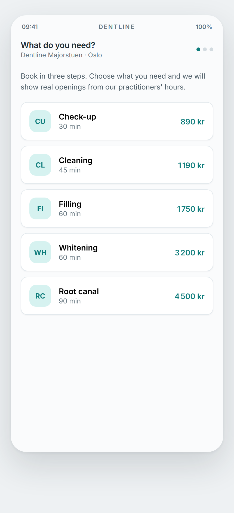
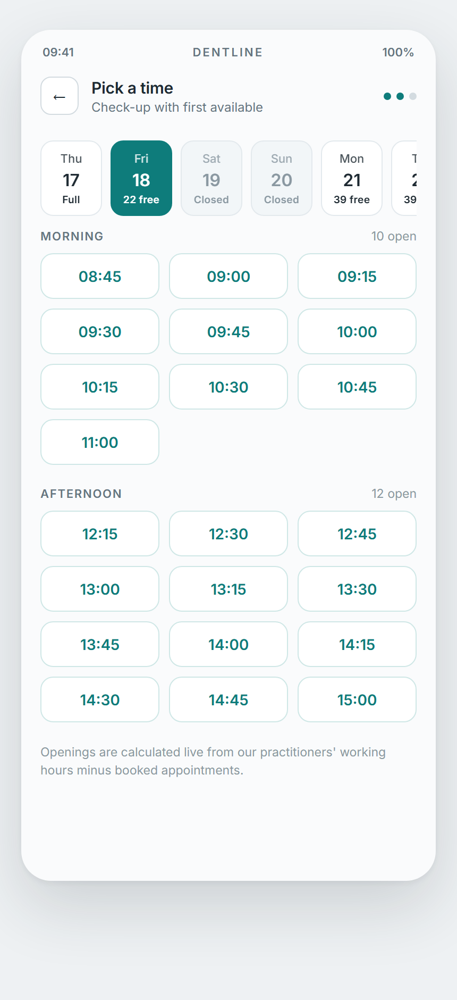
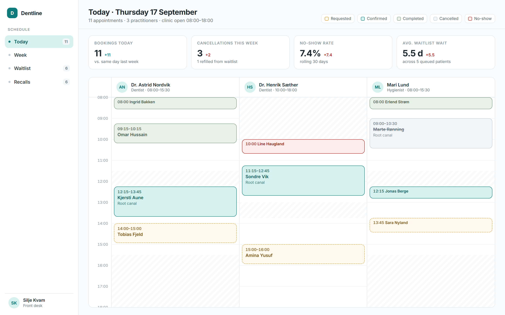
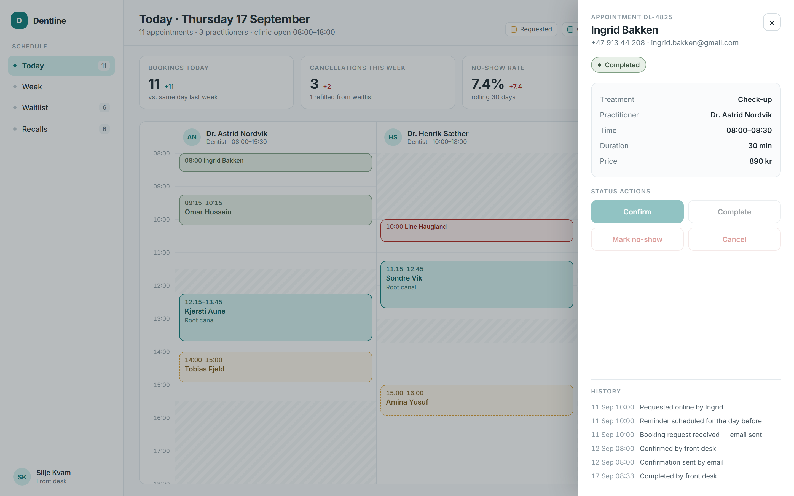
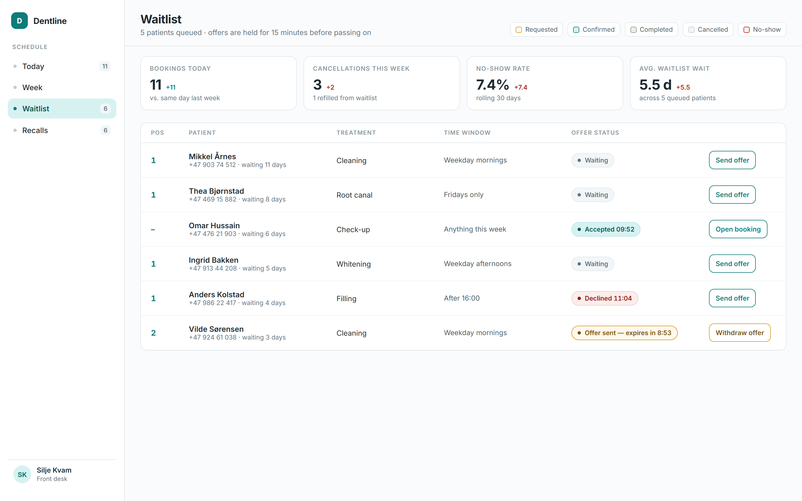
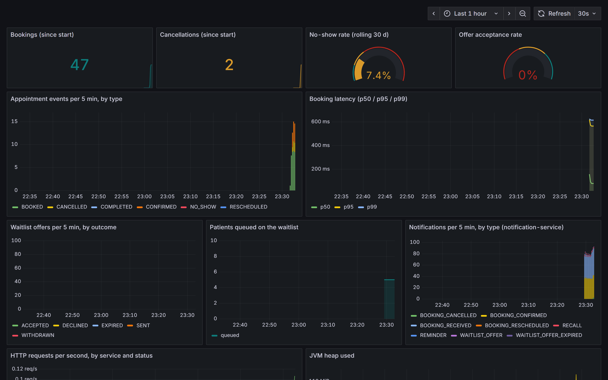
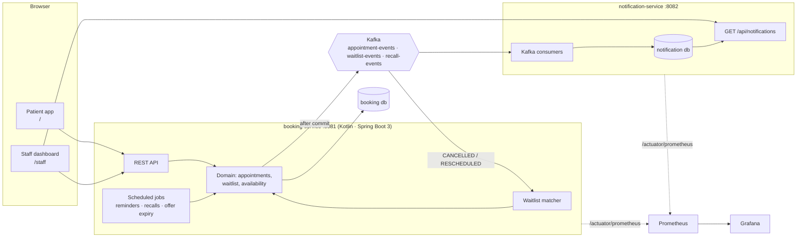

# Dentline

Appointment booking for a dental clinic: a patient booking flow with a waitlist, and a front-desk
dashboard. Two Kotlin/Spring Boot services talk through Kafka; a React frontend talks to both.

```
docker compose up --build
```

then open **http://localhost:3001** (patient booking) and **http://localhost:3001/staff** (clinic
dashboard). Grafana is on http://localhost:3000, Prometheus on http://localhost:9090. The first
start seeds a full demo week around today, including a waitlist offer that is counting down.

## Screens

Patient booking is mobile-first; the clinic dashboard is desktop-first. Both are the design
hand-off's screens, reproduced in React.

| Choose a treatment | Openings computed from working hours |
|---|---|
|  |  |

| Today, one column per practitioner |
|---|
|  |

| Appointment drawer | Waitlist with live offer countdown |
|---|---|
|  |  |

| Grafana, provisioned by compose |
|---|
|  |

---

## Contents

- [Architecture](#architecture)
- [Why events between the services](#why-events-between-the-services)
- [Why availability is computed, never stored](#why-availability-is-computed-never-stored)
- [Concurrency-safe booking](#concurrency-safe-booking)
- [Domain model](#domain-model)
- [Running it](#running-it)
- [Testing](#testing)
- [Observability](#observability)
- [Repository layout](#repository-layout)
- [Design decisions worth knowing](#design-decisions-worth-knowing)
- [Next steps for production](#next-steps-for-production)

---

## Architecture



| Piece | Role |
|---|---|
| **booking-service** | Owns the domain: practitioners, treatments, appointments, waitlist, slot offers. REST API, PostgreSQL via Flyway + JPA, publishes every state change to Kafka, runs the scheduled jobs and the waitlist matcher. |
| **notification-service** | Consumes the three topics and stores the message that *would* have been sent (delivery is simulated). Exposes them so the dashboard can show "Confirmation sent by email" in an appointment's history. Idempotent on `source_event_id`. |
| **frontend** | One Vite/React/TypeScript app. The patient flow and the staff dashboard are the design hand-off's screens, reproduced 1:1, on top of a single typed API client and TanStack Query. |
| **Kafka** | `appointment-events`, `waitlist-events`, `recall-events`. JSON, keyed by aggregate id, one consumer group per concern. |
| **Prometheus + Grafana** | Scrape both services; one provisioned dashboard. |

The wire contract is written down in [docs/02-api-contract.md](docs/02-api-contract.md); the
screen-by-screen mapping that produced it is in [docs/01-frontend-mapping.md](docs/01-frontend-mapping.md).

## Why events between the services

Booking must stay fast and must never fail because a downstream system is slow. Everything that
*reacts* to a booking — confirmation mail, reminder, cancellation notice, waitlist offer — happens
after the fact, so it is modelled as consumers of events rather than as calls inside the booking
transaction:

- **After-commit relay.** Services publish plain Spring application events inside the
  transaction; [`KafkaEventRelay`](booking-service/src/main/kotlin/no/dentline/booking/kafka/KafkaEventRelay.kt)
  forwards them to Kafka in `AFTER_COMMIT`. A rolled-back booking never reaches a consumer.
- **booking-service consumes its own events.** Waitlist matching runs when `CANCELLED` or
  `RESCHEDULED` is *consumed*, not when the cancel endpoint is called. Cancelling stays a
  ~10 ms transaction; matching (which takes the practitioner lock) happens right after, and can be
  retried by Kafka if it fails. The matcher is idempotent because a pending offer blocks the very
  window it was made for.
- **notification-service knows nothing about the booking schema.** It reads the JSON contract
  with its own DTOs and ignores unknown fields, so booking-service can evolve its payloads.

## Why availability is computed, never stored

There is no `slot` table. An opening is *the absence of anything in the calendar*, derived on every
request from three facts:

```
slots(practitioner, date, treatment) =
  for each working-hours window on that weekday:
    for t = window.start; t + treatment.duration <= window.end; t += slotStep:
      emit t unless it overlaps a REQUESTED/CONFIRMED appointment or a PENDING slot offer
```

([`AvailabilityCalculator`](booking-service/src/main/kotlin/no/dentline/booking/domain/AvailabilityCalculator.kt),
pure and unit-tested; [`AvailabilityService`](booking-service/src/main/kotlin/no/dentline/booking/service/AvailabilityService.kt)
feeds it data.)

Storing slots would mean keeping a second table consistent with the first: every booking, cancel,
reschedule, offer, working-hours change and treatment-duration change would have to update it, and
each of those is a place for the two to drift apart. Computing has no such state. It also makes
treatment length a first-class input — a 90-minute root canal and a 30-minute check-up see
different openings in the same calendar — and "first available" is just the same function over
several practitioners, merged. The cost is a few small indexed queries per request, which the
partial index on `(practitioner_id, start_time) where status in ('REQUESTED','CONFIRMED')` keeps
cheap.

The same rule is why `CANCELLED` and `NO_SHOW` appointments never block anything: they simply
stop being in the set the calculator looks at.

## Concurrency-safe booking

Two patients pressing "Confirm booking" on the same slot at the same time must produce exactly one
appointment. The guarantee comes from a row lock on the **practitioner** taken *before* the
overlap check, inside the booking transaction:

```sql
select * from practitioner where id = :id for update   -- PractitionerRepository.lockForUpdate
```

Every write to one practitioner's calendar — book, reschedule, accept a waitlist offer — goes
through that lock, so writes to one calendar are serialised while other practitioners' calendars
stay fully concurrent. The second transaction blocks on the lock, and when it proceeds it re-runs
its overlap query, now seeing the committed appointment, and fails with `409 SLOT_TAKEN`.

The lock is scoped to one row rather than a table because a busy clinic's practitioners are
independent; the lock is pessimistic rather than optimistic because a lost race here is a
double-booked patient, and the wait is milliseconds.

[`ConcurrentBookingIT`](booking-service/src/test/kotlin/no/dentline/booking/ConcurrentBookingIT.kt)
proves it against a real PostgreSQL in Testcontainers: two threads are released through a
`CyclicBarrier` so they hit `POST /api/appointments` at the same instant, and the test asserts one
`201`, one `409 SLOT_TAKEN`, one row in the database and one `BOOKED` event. A second case fires
ten requests at one slot; a third shows two practitioners do not block each other. Removing the
`for update` makes the first two cases fail (ten patients get the same slot) — that is how the
test was validated.

Other locks, for completeness: status transitions lock the appointment row; reschedule locks the
appointment first, then the practitioners involved in id order, so two crossing reschedules cannot
deadlock; accepting an offer locks the waitlist entry, then the practitioner.

## Domain model

```
Practitioner ──< WorkingHours (dayOfWeek, start, end; several rows = breaks)
TreatmentType (code, name, durationMinutes, priceNok)
Appointment (reference DL-nnnn, patient, practitioner, treatment, start, end, status) ──< AppointmentHistoryEntry
WaitlistEntry (patient, treatment, practitioner?, preferredWindows, status) ──< SlotOffer (window, expiresAt, status)
RecallNotice (patientEmail → last sent)
```

Appointment lifecycle (illegal moves throw and become `409 ILLEGAL_TRANSITION`):

```
REQUESTED ──► CONFIRMED ──► COMPLETED
    │             │
    ├──► CANCELLED ◄──┤
    └──► NO_SHOW   ◄──┘
```

Online bookings start as `REQUESTED`; the front desk confirms. Accepting a waitlist offer creates
the appointment as `CONFIRMED` directly.

Waitlist: an entry is `WAITING` until a freed window matches it (treatment fits, start satisfies a
preferred window and the practitioner preference, patient has not already declined that slot).
The match creates a `SlotOffer` that expires after 15 minutes and holds the window. Accept →
`ACCEPTED` + appointment. Decline or expiry → the entry keeps its place in the queue and the window
moves on to the next match in the same transaction. Position is never stored; it is the rank by
creation time within the treatment's queue.

## Running it

**Everything, one command** (needs Docker Desktop):

```
docker compose up --build
```

| URL | What |
|---|---|
| http://localhost:3001 | Patient booking (`/`), my appointment (`/appointments/{id}`), queue (`/waitlist/{id}`) |
| http://localhost:3001/staff | Today · Week · Waitlist · Recalls |
| http://localhost:8081/swagger-ui.html | booking-service API, browsable (OpenAPI at `/v3/api-docs`) |
| http://localhost:8082/swagger-ui.html | notification-service API |
| http://localhost:9090 | Prometheus |
| http://localhost:3000/d/dentline-overview | Grafana dashboard (anonymous viewer; admin/admin to edit) |

The first start takes a few minutes: the images build the services with Gradle inside Docker, and
Kafka needs a moment. The demo seed (`DENTLINE_SEED=true` in compose) then creates, relative to
today: a full working week with every status including one no-show and cancellations, a
clinic-wide fully booked day, six recall candidates, and a six-person waitlist with one offer
counting down. The seed only runs on an empty database, so `docker compose down -v` before `up`
gives you a fresh countdown.

**Backend on the host, infrastructure in Docker:**

```
docker compose up postgres kafka
./gradlew :booking-service:bootRun
./gradlew :notification-service:bootRun
```

**Frontend with hot reload:**

```
cd frontend && npm install && npm run dev      # http://localhost:5173, CORS is pre-allowed
```

Defaults point the frontend at `localhost:8081`/`8082`; override with `VITE_BOOKING_API` /
`VITE_NOTIFICATION_API` (see `frontend/.env.example`).

Configuration lives in each service's `application.yml`; the clinic settings (`dentline.*`: time
zone, slot step, offer hold, CORS origins, seed) are also reported by `GET /api/config`.

## Testing

```
./gradlew test              # backend, both modules (Docker must be running)
cd frontend && npm test     # frontend
```

| Layer | Where | Covers |
|---|---|---|
| Unit | `booking-service/src/test/.../domain` | The state machine (every legal and illegal transition), availability edge cases (end-of-day boundary, treatment longer than the remaining window, lunch breaks, overlapping windows, past slots, first-available merge), waitlist windows and offers. |
| Integration (Postgres + Kafka via Testcontainers) | `BookingFlowIT`, `AvailabilityIT`, `WaitlistFlowIT`, `ScheduledJobsIT`, `MetricsSummaryIT`, `PrometheusMetricsIT`, `DemoDataSeederIT`, `NotificationServiceIT` | Booking, validation and 409s, publishing and consuming events, the waitlist end to end (book → cancel → offer → accept, decline passes the slot on, expiry sweep), reminders and recalls, the metrics scrape, the seed on any weekday. |
| Concurrency | `ConcurrentBookingIT` | The double-booking guarantee, described above. |
| Frontend (Vitest + Testing Library) | `frontend/src/**/*.test.ts(x)` | Reading the API's timestamps without time-zone arithmetic, price and date formatting, ISO weeks, the status palette, the booking form's validation rules, the first booking step, and the dialog behaviour below. |

The backend containers start once per test JVM and are shared by every test class; each test
truncates the tables it uses. On a small machine, do not run the suite while `docker compose` is
building — the containers will time out. CI runs both suites on every push.

**Accessibility.** The prototypes did not implement focus management, so the real build adds it:
[`useDialog`](frontend/src/components/useDialog.ts) moves focus into a dialog when it opens, keeps
Tab inside it, closes it on Escape, and restores focus to whatever opened it. Only the topmost
dialog reacts, so Escape in a confirm dialog opened from the drawer does not close both. The
waitlist offer is an `alertdialog` with no Escape, because it asks for a decision. Status is never
signalled by colour alone: every badge pairs a dot with a text label.

## Observability

Both services expose Spring Boot Actuator (`/actuator/health`, `/actuator/prometheus`).
[`BookingMetrics`](booking-service/src/main/kotlin/no/dentline/booking/metrics/BookingMetrics.kt)
adds, after commit so they count what actually happened:

| Metric | Meaning |
|---|---|
| `dentline_appointments_total{event}` | bookings and every transition |
| `dentline_cancellations_total{by}` | cancelled by patient or staff |
| `dentline_waitlist_offers_total{outcome}` | sent / accepted / declined / expired / withdrawn |
| `dentline_no_show_rate` | rolling 30 days, refreshed every minute |
| `dentline_waitlist_offer_acceptance_rate` | accepted ÷ answered |
| `dentline_waitlist_queued` | entries currently in a queue |
| `dentline_booking_latency_seconds` | histogram around `POST /api/appointments`, tagged `outcome=created\|rejected` |
| `dentline_notifications_total{type}` | notification-service |

The dashboard's four stat cards read `GET /api/staff/metrics/summary`, computed from the database
(bookings today vs. the same weekday last week, cancellations this week and how many were refilled
from the waitlist, no-show rate over 30 days, mean days from joining the waitlist to accepting an
offer). Prometheus is the operational view; the cards are the business view. They agree on
definitions but are not the same query.

## Repository layout

```
booking-service/        Kotlin · Spring Boot · domain, REST, Kafka producer + matcher consumer, jobs, seed
notification-service/   Kotlin · Spring Boot · Kafka consumers, notification store and endpoint
frontend/               React 18 · TypeScript · Vite · TanStack Query · react-router · Vitest
docker/                 postgres init, prometheus config, grafana provisioning + dashboard
docs/                   01 frontend mapping (the design read as a spec) · 02 API contract · images
scripts/                screenshots.mjs, which captures the images above from a running stack
design_handoff_dentline/  The original design prototypes; reference only, not part of the build
docker-compose.yml      Postgres, Kafka (KRaft), both services, frontend, Prometheus, Grafana
```

Inside booking-service: `domain` (entities with behaviour, pure calculator, exceptions),
`repository` (Spring Data, the `for update` queries), `service` (transactions and locks),
`web` (controllers, DTOs, problem-detail errors), `event` + `kafka` (events, after-commit relay,
consumer), `jobs`, `metrics`, `seed`.

## Design decisions worth knowing

- **No authentication.** Out of scope for this exercise. The UUID in the reminder link is the
  patient's capability; everything under `/api/staff/**` and the staff-only transitions would sit
  behind a staff role. See next steps.
- **Times.** The API renders every instant as ISO-8601 with the clinic's offset (`Europe/Oslo`,
  configurable). The frontend shows the wall-clock part of the string as-is, so there is no
  time-zone arithmetic in the browser. Working hours are `HH:mm`; dates are `YYYY-MM-DD`.
- **Errors** are RFC 7807 problem+json: `400` with a field list (the form's own copy), `404`,
  `409` with a machine-readable `code` (`SLOT_TAKEN`, `OUTSIDE_WORKING_HOURS`, `IN_THE_PAST`,
  `ILLEGAL_TRANSITION`, `OFFER_NOT_ACTIVE`, `OFFER_ALREADY_PENDING`, `NO_MATCHING_SLOT`).
- **Patient identity is the normalised email.** There is no patient table; recalls and the
  "average waitlist wait" group by it.
- **Staff "Send offer"** has no slot picker in the design, so the server offers the earliest free
  slot in the next 14 days that matches the entry's treatment, practitioner and windows.
- **JPA with assigned UUIDs**: `repository.save(newEntity)` merges and returns a managed copy;
  code always uses the returned instance before mutating. (This bit us once, in the seed.)
- **Scheduled jobs** run in the clinic's zone: reminders at 18:00 for the next day, recalls at
  06:00 for anyone six months past their last completed check-up (listed from a month before,
  resent after 30 days), offer expiry every minute. Each job is idempotent (`reminder_sent_at`,
  `recall_notice`, offer status), so a re-run sends nothing twice.

## Next steps for production

- **Authentication and authorisation.** Patients get a signed, expiring link (or OTP) instead of
  a bare UUID; staff sign in (OIDC) and `/api/staff/**` plus `confirm`/`complete`/`no-show`
  require the role. The frontend's two halves become two deployables with different origins.
- **Outbox pattern.** The after-commit relay is at-least-once with a small window for loss if the
  process dies between commit and send. Write events to an `outbox` table in the same transaction
  and let a relay (or Debezium) publish them; consumers already dedupe on `eventId`.
- **Idempotent consumers everywhere.** notification-service is (unique `source_event_id`); the
  waitlist matcher is idempotent by construction. Add an explicit processed-events table when
  more consumers arrive, and dead-letter topics for poison messages.
- **Migration strategy.** Flyway is in place; adopt expand/contract for schema changes (add
  nullable → backfill → switch reads → drop), never edit an applied migration, and run migrations
  as a separate step before rolling out a new service version rather than on startup.
- **Multiple instances.** Wrap the scheduled jobs in a distributed lock (ShedLock) or move them
  to one leader; the booking lock itself already works across instances because it is in Postgres.
- **A patient entity** with consent and contact preferences, instead of email as the identity.
- **Real delivery** in notification-service (SMS/email providers) with delivery status, and
  push (SSE/WebSocket) to the patient app instead of polling for the offer.
- **Slot holds while filling in the form**, if the product wants the copy "your slot is held while
  you fill this in" to be literally true: a short-lived `SlotOffer`-like hold created when the
  slot is picked.
- **Hardening**: rate limiting on the public endpoints, request ids in logs, structured logging,
  tracing (Micrometer Tracing → OTLP), secrets from a vault instead of compose defaults.
- **Before any public demo deployment**: because there is no authentication, a public URL would let
  anyone book, cancel and mark no-shows on the demo data. That needs rate limiting and a nightly
  job that wipes and re-seeds, on top of TLS and a reverse proxy.

---

## License

MIT, see [LICENSE](LICENSE). The files in `design_handoff_dentline/` are the original design
prototypes the build was made from, kept for reference.
